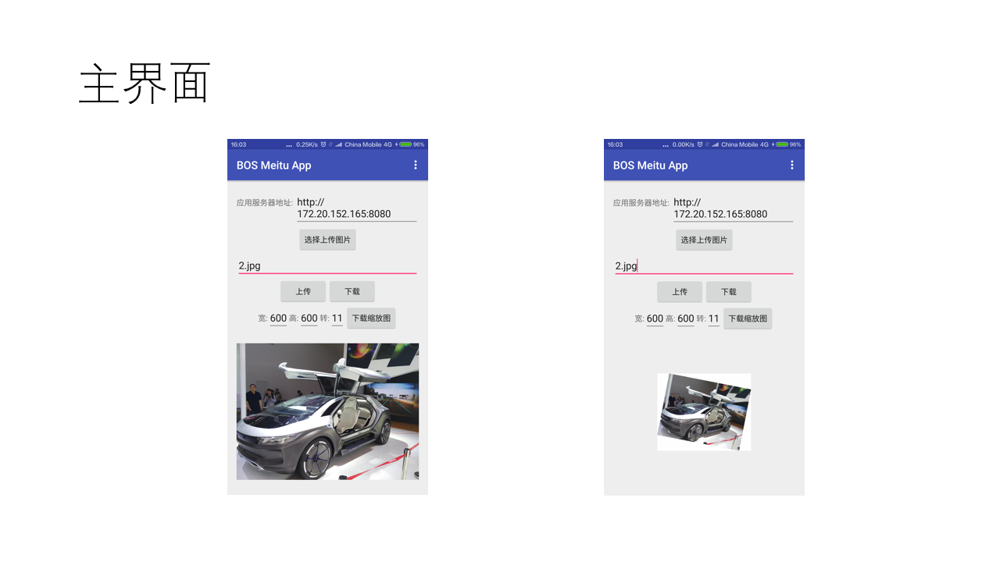
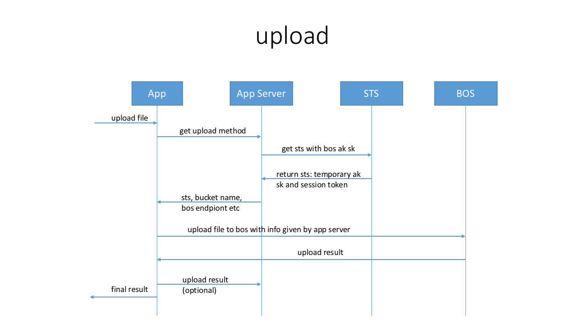
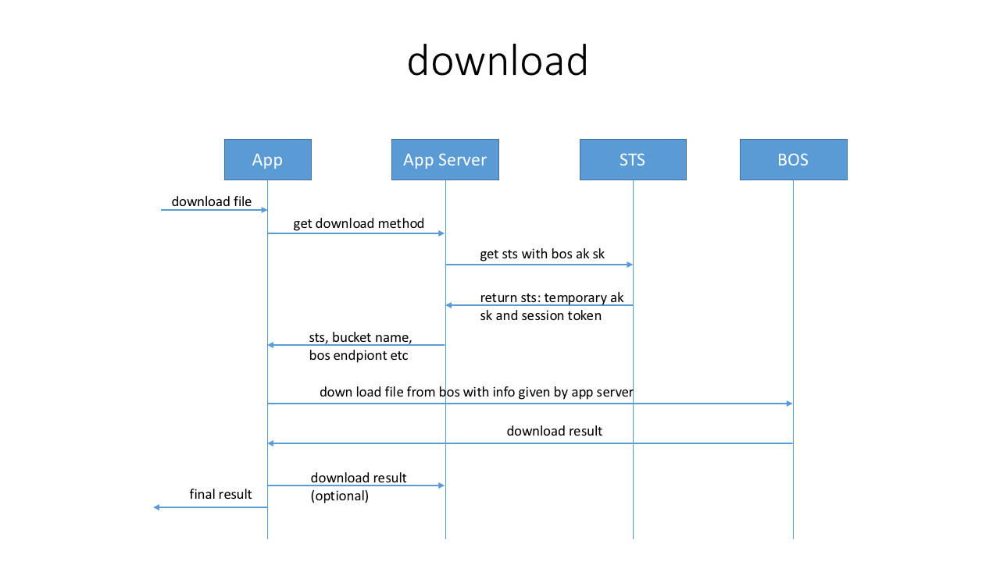
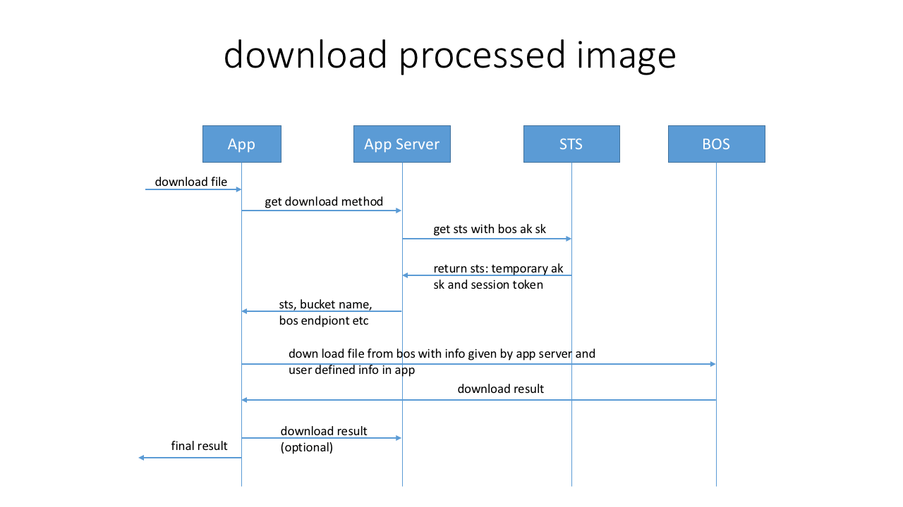

# BOS service application sample

This project demonstrates a simple application of BOS(Baidu Object Storage cloud
service), and shows how to use BCE sts token to access the app developers
possessed cloud resources directly without leaking their credentials.

## Dependencies
1. bce-android-sdk, to implement the android app
2. jetty, bce-java-sdk, to implement the app server

## Procedure

## Android App

### Implementation of uploading file to BOS

	public void uploadPicToBos() {
	    // 1. get pic params from ui: file name, file location uri etc
	    // 2. send params to app server and get sts, bucket name and region
	    // 3. upload selected pic to bos with sts etc, which bos client needs

	    EditText et = (EditText) findViewById(R.id.app_server_addr_edittext);
	    final String appServerAddr = et.getText().toString();

	    new Thread(new Runnable() {
	        @Override
	        public void run() {
	            Map<String, Object> bosInfo = AppServer.getBosInfoFromAppServer(appServerAddr, "user-demo",
	                    AppServer.BosOperationType.UPLOAD);

	            if (bosInfo == null) {
	                return;
	            }
	            showToast(bosInfo.toString(), Toast.LENGTH_LONG);

	            String ak = (String) bosInfo.get("ak");
	            String sk = (String) bosInfo.get("sk");
	            String stsToken = (String) bosInfo.get("stsToken");
	            String endpoint = (String) bosInfo.get("endpoint");
	            String bucketName = (String) bosInfo.get("bucketName");
	            String objectName = (String) bosInfo.get("objectName");
	            String prefix = (String) bosInfo.get("prefix");
	            Log.i("UploadFileToBos", bosInfo.toString());

	            // specify a object name if the app server does not specify one
	            if (objectName == null || objectName.equalsIgnoreCase("")) {
	                objectName = ((EditText) findViewById(R.id.bos_object_name_edittext)).getText().toString();
	                if (prefix != null && !prefix.equalsIgnoreCase("")) {
	                    objectName = prefix + "/" + objectName;
	                }
	            }

	            Bos bos = new Bos(ak, sk, endpoint, stsToken);
	            try {
	                byte[] data = Utils.readAllFromStream(MainActivity.this.getContentResolver().openInputStream(selectedPicUri));
	                bos.uploadFile(bucketName, objectName, data);
	            } catch (Throwable e) {
	                Log.e("MainActivity/Upload", "Failed to upload file to bos: " + e.getMessage());
	                showToast("Failed to upload file: " + e.getMessage());
	                return;
	            }
	            // finished uploading file, send a message to inform ui
	            handler.sendEmptyMessage(UPLOAD_FILE_FINISHED);
	        }
	    }).start();
	}

### Implementation of getting BOS info from app server

	public class AppServer {
	    /**
	     * get info from app server for the file to upload to or download from BOS
	     *
	     * @param appServerEndpoint app server
	     * @param userName          the app user's name, registered in app server
	     * @param bosOperationType  download? upload? or?
	     * @return STS, and BOS endpoint, bucketName, prefix, path, object name etc
	     */
	    public static Map<String, Object> getBosInfoFromAppServer(String appServerEndpoint, String userName, BosOperationType bosOperationType) {
	        String type = "";
	        switch (bosOperationType) {
	            // to simplify
	            case UPLOAD: {
	                type = "upload";
	                break;
	            }
	            case DOWNLOAD: {
	                type = "download";
	                break;
	            }
	            case DOWNLOAD_PROCESSED: {
	                type = "download-processed";
	                break;
	            }
	            default:{
	                break;
	            }
	        }
	        // TODO: this url should be url encoded
	        String appServerUrl = appServerEndpoint + "/?" + "userName=" + userName + "&command=stsToken&type=" + type;
	
	        // create a http client to contact app server to get sts
	        HttpParams httpParameters = new BasicHttpParams();
	        HttpClient httpClient = new DefaultHttpClient(httpParameters);
	
	        HttpGet httpGet = new HttpGet(appServerUrl);
	        httpGet.addHeader("User-Agent", "bos-meitu-app/demo");
	        httpGet.setHeader("Accept", "*/*");
	        try {
	            httpGet.setHeader("Host", new URL(appServerUrl).getHost());
	        } catch (MalformedURLException e) {
	            e.printStackTrace();
	        }
	        httpGet.setHeader("Accept-Encoding", "identity");
	
	        Map<String, Object> bosInfo = new HashMap<String, Object>();
	        try {
	            HttpResponse response = httpClient.execute(httpGet);
	            if (response.getStatusLine().getStatusCode() != 200) {
	                return null;
	            }
	            HttpEntity entity = response.getEntity();
	            long len = entity.getContentLength();
	            InputStream is = entity.getContent();
	            int off = 0;
	            byte[] b = new byte[(int) len];
	            while (true) {
	                int readCount = is.read(b, off, (int) len);
	                if (readCount < 0) {
	                    break;
	                }
	                off += readCount;
	            }
	            Log.d("AppServer", new String(b, "utf8"));
	            JSONObject jsonObject = new JSONObject(new String(b, "utf8"));
	            Iterator<String> keys = jsonObject.keys();
	            while (keys.hasNext()) {
	                String key = keys.next();
	                bosInfo.put(key, jsonObject.get(key));
	            }
	        } catch (IOException e) {
	            e.printStackTrace();
	            return null;
	        } catch (JSONException e) {
	            e.printStackTrace();
	            return null;
	        }
	        return bosInfo;
	    }
	
	    public enum BosOperationType {
	        UPLOAD,
	        DOWNLOAD,
	        DOWNLOAD_PROCESSED,
	    }
	}

### Encapsulation of BOS client

	public class bos {
	    private string ak = null;
	    private string sk = null;
	    private string endpoint = null;
	    private string ststoken = null;
	    private bosclient client = null;
	
	    public bos(string ak, string sk, string endpoint, string ststoken) {
	        this.ak = ak;
	        this.sk = sk;
	        this.endpoint = endpoint;
	        this.ststoken = ststoken;
	        client = createclient();
	    }
	
	    public bosclient createclient() {
	        bosclientconfiguration config = new bosclientconfiguration();
	        bcecredentials credentials = null;
	        if (ststoken != null && !ststoken.equalsignorecase("")) {
	            credentials = new defaultbcesessioncredentials(ak, sk, ststoken);
	        } else {
	            credentials = new defaultbcecredentials(ak, sk);
	        }
	        config.setendpoint(endpoint);
	        config.setcredentials(credentials);
	        return new bosclient(config);
	    }
	
	    public void uploadfile(string bucket, string object, file file) {
	        client.putobject(bucket, object, file);
	    }
	
	    public void uploadfile(string bucket, string object, inputstream inputstream) {
	        client.putobject(bucket, object, inputstream);
	    }
	
	    public void uploadfile(string bucket, string object, byte[] data) {
	        client.putobject(bucket, object, data);
	    }
	
	    public byte[] downloadfilecontent(string bucket, string object) {
	        return client.getobjectcontent(bucket, object);
	    }
	}

## App server, implementation of `getBosInfo`

App server is based on Jetty framework, this server handles requests of getting
BOS info from Android App. Responses with temporary ak, sk, stsToken, bucket
name, path of the resource and the endpoint to request the resource.

Here is the sample code of the Jetty handler:

	@Override
	public void handle(String target, Request baseRequest, HttpServletRequest request, HttpServletResponse response)
	        throws IOException, ServletException {

	    // Inform jetty that this request has now been handled
	    baseRequest.setHandled(true);

	    if (!request.getMethod().equalsIgnoreCase("GET")) {
	        response.setStatus(HttpServletResponse.SC_NOT_IMPLEMENTED);
	        return;
	    }

	    // expected url example: localhost:8080/?command=stsToken&type=download
	    Map<String, String[]> paramMap = request.getParameterMap();
	    if (paramMap.get("command") == null || paramMap.get("type") == null) {
	        // invalid request
	        response.setStatus(HttpServletResponse.SC_BAD_REQUEST);
	        return;
	    }

	    if (!paramMap.get("command")[0].equalsIgnoreCase("stsToken")) {
	        response.setStatus(HttpServletResponse.SC_NOT_IMPLEMENTED);
	        return;
	    }

	    String responseBody = "";
	    responseBody = getBosInfo(paramMap.get("type")[0]);

	    // Declare response encoding and types
	    response.setContentType("application/json; charset=utf-8");

	    // Declare response status code
	    response.setStatus(HttpServletResponse.SC_OK);

	    // Write back response, utf8 encoded
	    response.getWriter().println(responseBody);
	}

	/**
	 * Generates bos info needed by app according to requset type(upload, download etc)
	 * this is the key part for uploading file to bos with sts token
	 * @param bosRequestType 
	 * @return utf8 encoded json string
	 */
	public String getBosInfo(String bosRequestType) {
	    // configuration for getting stsToken
	    // bce bos credentials ak sk
	    String bosAk = "your_bos_ak";
	    String bosSk = "your_bos_sk";
	    // bce sts service endpoint
	    String stsEndpoint = "http://sts.bj.baidubce.com";

	    BceCredentials credentials = new DefaultBceCredentials(bosAk, bosSk);
	    BceClientConfiguration clientConfig = new BceClientConfiguration();
	    clientConfig.setCredentials(credentials);
	    clientConfig.setEndpoint(stsEndpoint);
	    StsClient stsClient = new StsClient(clientConfig);
	    GetSessionTokenRequest stsReq = new GetSessionTokenRequest();
	    // request expiration time
	    stsReq.setDurationSeconds(1800);
	    GetSessionTokenResponse stsToken = stsClient.getSessionToken(stsReq);
	    String stsTokenAk = stsToken.getCredentials().getAccessKeyId();
	    String stsTokenSk = stsToken.getCredentials().getSecretAccessKey();
	    String stsTokenSessionToken = stsToken.getCredentials().getSessionToken();

	    // **to simplify this demo there is no difference between "download" and "upload"**
	    // parts of bos info
	    String bosEndpoint = "http://bos.bj.baidubce.com";
	    String bucketName = "bos-android-sdk-app";
	    if (bosRequestType.equalsIgnoreCase("download-processed")) {
	        // the binded image processing domain set by App developer on bce console
	        bosEndpoint = "http://" + bucketName + ".bceimg.com";
	    }

	    // prefix is the bucket name, and does not specify the object name
	    BosInfo bosInfo = new BosInfo(stsTokenAk, stsTokenSk, stsTokenSessionToken, bosEndpoint,
	            bucketName, "", bucketName);

	    String res = "";
	    ObjectMapper mapper = new ObjectMapper();
	    try {
	        res = mapper.writerWithDefaultPrettyPrinter().writeValueAsString(bosInfo);
	    } catch (JsonProcessingException e) {
	        e.printStackTrace();
	        res = "";
	    }
	    try {
	        res = new String(res.getBytes(), "utf8");
	    } catch (UnsupportedEncodingException e) {
	        // TODO Auto-generated catch block
	        e.printStackTrace();
	        res = "";
	    }
	    return res;
	}
